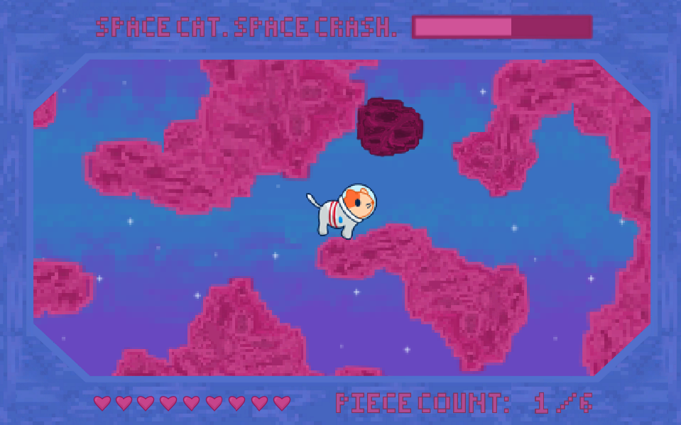
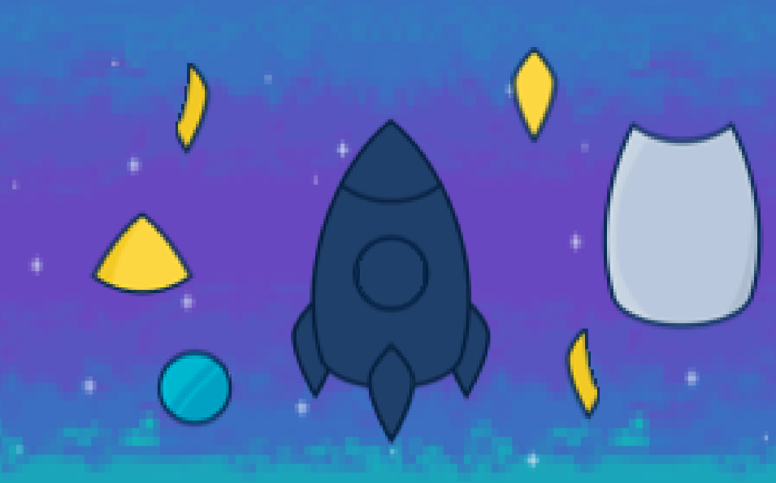

# Space Cat. Space Crash.
## About the Project
*Space Cat. Space Crash.* is an adventure puzzle game, where the player must overcome time-constraining obstacles to find pieces that will help them solve their puzzle. The game incorporates a storyline where the protagonist, Space Cat, crashes their spacecraft on Mars. The objective of the game is to save Space Cat, by finding the pieces + reassembling their spacecraft, so that they can escape the planet before it is too late.

  
  

## How to Play
A tutorial can be found once the game is launched. [Play here!](https://livelliott.github.io/space-cat-space-crash/Builds/index.html)

Created by [@livelliott](https://github.com/livelliott), [@dajungyoon](https://github.com/dajungyoon), and [@Gansito52](https://github.com/Gansito52)
